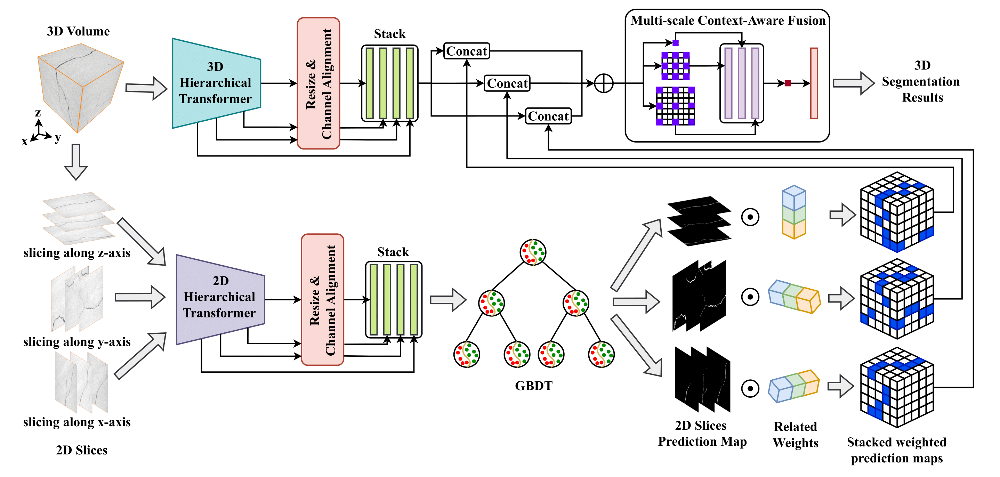

# FractureSeg3D

This is the official repository for "Connectivity-Aware 3D Fracture Segmentation Method for Core CT Images". Please cite this work if you find this repository useful for your project.


Accurately extracting the fracture structures from three-dimensional (3D) computed tomography (CT) images is essential for simulating and analyzing the physical properties of digital rocks. However, the heterogeneity within the rocks makes it difficult for threshold-based methods to identify blurred fracture boundaries. Furthermore, fractures have a complex spatial topological structure, resulting in existing slice-based segmentation methods ineffective in capturing spatial connectivity information. To address the above problems, a novel fracture segmentation method for 3D core CT images is proposed in this study. Firstly, we introduced a 3D multi-layer Transformer network to capture long-range dependence information and pixel spatial continuity features between adjacent layers. Then, we fed three axial slices into a 2D multi-layer Transformer network to extract anisotropic features from multi-views. Subsequently, these features are fed into the Gradient Boosting Decision Tree (GBDT) module, which is iteratively enhanced by weaker learners to obtain preliminary segmentation probability maps. To correct the contribution of these maps to the segmentation results, we add dynamic weights to each of them and adjust it by backpropagation of the loss function. Finally, a multi-scale context-aware fusion module fused spatial continuity features with these maps to obtain segmentation results. We compare it with other state-of-the-art methods and the experiment results demonstrate the superiority of our method in spatial structure connectivity of fracture.



## Usage

### Requirements

```bash
pip install torch==1.10.0+cu111 torchvision==0.11.0+cu111 torchaudio==0.10.0 -f https://download.pytorch.org/whl/torch_stable.html

pip install -r requirements.txt
```

### Dataset Preprocessing

```bash
python crop_dataset.py
```

### Training

```bash
python train.py
```


### Evaluation

```bash
python evaluation.py
```


### Inference

```bash
python inference.py
```


